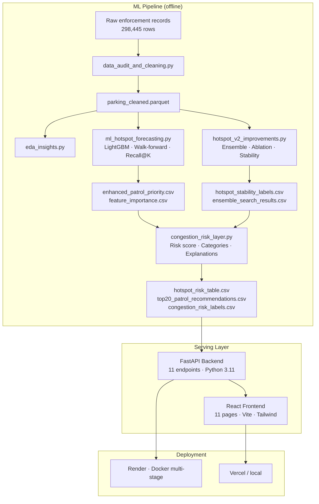

# ParkIntel AI

**Parking hotspot forecasting and patrol deployment intelligence for Bengaluru**

> Built for Flipkart Grid Round 2. This system predicts illegal parking hotspot
> locations and ranks patrol deployment priorities using a LightGBM forecasting model
> trained on Bengaluru traffic enforcement records.
>
> ⚠️ **Scientific scope**: This system predicts parking violation counts and estimates
> *parking-induced* congestion risk. It does **not** predict actual traffic congestion,
> speed, or flow. The congestion risk score is a proxy indicator derived from parking
> enforcement records — not a measured traffic index.

---

## Overview

ParkIntel AI answers three operational questions for Bengaluru traffic enforcement teams:

1. **Where** will the most violations occur next month? — LightGBM forecasting
2. **Which zones** pose the highest traffic disruption risk? — Composite proxy risk scoring
3. **Where should patrol units go first?** — Ranked deployment list with stability context

The system is backed by 298,445 enforcement records across 54 police stations
(Nov 2023 – Apr 2024), produces a ranked list of 606 spatial cells, and is served
through a FastAPI backend with an 11-page React dashboard.

---

## Problem Statement

Bengaluru traffic enforcement teams file close to 300,000 parking violation records
over a 6-month period but deploy patrol units based on institutional memory and fixed
routes, not data-driven prediction.

The data reveals a structural problem: violation activity is highly concentrated.
A single ~500m grid cell (CELL_2595_15515, UPPARPET) accumulated 20,798 violations
over 6 months. The top-20 cells account for a disproportionate share of total
enforcement demand. Despite this, there is no automated signal directing patrol
resources to high-probability zones before violations peak.

### Why It Matters

- **Wasted capacity**: Officers patrol low-violation zones while high-density zones
  receive inconsistent coverage.
- **No escalation signal**: Rising hotspot cells (Emerging stability class) are invisible
  until they become chronic enforcement problems.
- **Reactive posture**: Shift commanders make deployment decisions on gut feel or
  complaint response rather than predictive ranking.

---

## Key Results

All metrics are verified from output files in this repository.

| Metric | Value | Source |
|---|---|---|
| LightGBM Recall@20 | **0.775** | `outputs/ensemble_search_results.csv` |
| Best ensemble Recall@50 | **0.820** | `outputs/ensemble_search_results.csv` |
| Monthly lag-1 autocorrelation | **0.932** | `outputs/window_granularity_comparison.csv` |
| Top-20 month-over-month overlap | **0.73** | `outputs/window_granularity_comparison.csv` |
| Persistent hotspot cells | **155** | `outputs/hotspot_stability_labels.csv` |
| Critical risk zones | **153** | `outputs/congestion_risk_labels.csv` |
| Top patrol cell predicted count | **3,182 / month** | `outputs/top20_patrol_recommendations.csv` |

**Recall@20 = 0.775** means: of the 20 cells that will truly have the most violations
next month, the model correctly identifies 15–16 of them. A patrol commander who follows
this ranked list will cover 77.5% of the worst zones before violations peak.

---

## System Overview

```
Raw enforcement records (298,445)
    ↓  data_audit_and_cleaning.py
Cleaned + validated parquet
    ↓  eda_insights.py
Station / junction analytics CSVs
    ↓  ml_hotspot_forecasting.py
LightGBM model + patrol priority CSV
    ↓  hotspot_v2_improvements.py
Ensemble evaluation + stability labels
    ↓  congestion_risk_layer.py
Risk scores + patrol ranking + explanations
    ↓  FastAPI backend (backend/)
11 REST endpoints (in-memory DataStore)
    ↓  React frontend (frontend/)
11-page dashboard
```

---

## Architecture



---

## Dataset

### Coverage

| Dimension | Value |
|---|---|
| Total records | 298,445 |
| Records with valid GPS | 298,282 |
| Time window | November 2023 – April 2024 |
| Police stations | 54 |
| Junctions | 168 |
| Spatial grid cells (active) | 1,391 |
| Cells with full patrol ranking | 606 |

### Key Fields

| Field | Description |
|---|---|
| `spatial_cell_id` | ~500m grid cell identifier |
| `created_datetime` | Timestamp with timezone |
| `_lat_raw`, `_lon_raw` | GPS coordinates |
| `valid_geo_flag` | 1 = within Bengaluru bounding box |
| `police_station` | Assigned station |
| `junction_name` | Nearest junction (nullable) |
| `validation_flag_binary` | 1 = approved, 0 = rejected |
| `validation_status_final` | APPROVED / REJECTED / PENDING / UNKNOWN |
| `violation_type_parsed` | List of violation codes per record |
| `primary_violation_type` | Dominant violation type |
| `vehicle_type_final` | Standardized vehicle category |
| `is_peak_hour` | Binary peak-hour flag |
| `is_near_duplicate` | 1 = flagged near-duplicate (excluded from count target) |

### Missing Fields

The dataset does **not** contain:
- Traffic speed measurements
- Vehicle flow counts
- Road occupancy data
- Queue length observations
- Congestion index values

Direct congestion prediction is therefore impossible with this dataset.

### Dataset Limitations

| Limitation | Impact |
|---|---|
| **Enforcement bias** | Records show where officers went — not all locations where violations occurred |
| **April truncation** | April 2024 contains only 8 days of data; normalized by factor 3.75 |
| **42% unresolved validation** | 42% of records never received APPROVED/REJECTED decision |
| **Near-duplicates (3.7%)** | 10,928 records flagged as near-duplicate; excluded from count targets |
| **Only 6 months** | Seasonal patterns cannot be confirmed without a second annual cycle |
| **SCITA delay** | Median 17.9-day transmission delay to city intelligence systems |

---

## Key Insights From Analysis

**Spatial concentration** — One cell (CELL_2595_15515, UPPARPET, lat=12.9772, lon=77.5772)
accumulated 20,798 violations over 6 months — the highest of any cell.
Source: `outputs/insight_report.md`

**Strong temporal autocorrelation** — Monthly lag-1 correlation = 0.932 across all
consecutive month pairs (range: 0.906–0.954). A cell's violation count this month is
an extremely reliable predictor of next month's count.
Source: `outputs/forecastability_table.csv`

**Monthly granularity is optimal** — Empirically compared against biweekly (r=0.924)
and weekly (r=0.865). Monthly top-20 overlap (0.73) also exceeds biweekly (0.715) and
weekly (0.639). Monthly patrol cycles are supported by the data structure.
Source: `outputs/window_granularity_comparison.csv`

**Top-20 overlap = 0.73** — Without any model, 73% of next month's top-20 cells can be
predicted just by looking at this month's top-20. Hotspots are structurally stable.
Source: `outputs/window_granularity_comparison.csv`

**155 persistent cells** — 155 of 1,391 cells appear as hotspots in every monitored month.
1,094 are volatile, 82 declining, 60 emerging.
Source: `outputs/hotspot_stability_labels.csv`

**Top-4 patrol cells are all Persistent** — The highest-priority patrol targets
(UPPARPET #1, CITY MARKET #2, SHIVAJINAGAR #3–#4) are all structurally persistent.
Source: `outputs/top20_patrol_recommendations.csv`

**Lag features are irreplaceable** — Removing the Lag feature group from LightGBM
drops Recall@20 from 0.70–0.85 to 0.50–0.50 (20–35pp collapse across both primary folds).
Source: `outputs/feature_group_ablation.csv`

**UPPARPET is the most strained station** — 34,468 cases, 44.67% approval rate,
ops score 0.89 (highest of 54 stations).
Source: `outputs/eda_station_rankings.csv`

**82.5% of violations are outside peak hours** — Enforcement happens mostly in off-peak
windows, reflecting officer shift schedules rather than peak violation times.
Source: `outputs/insight_report.md`

---

## Forecasting Methodology

### Why Forecasting Is Valid

The forecasting problem is empirically grounded:
- Lag-1 autocorrelation = 0.932 — history strongly predicts future
- Top-20 monthly overlap = 0.73 — hotspot identity is stable, not random
- 155 persistent cells appear every month without exception

These three observations confirm that a predictive model is both justified and
operationally valuable.

### Validation Methodology

Walk-forward temporal expanding window — no random splits, no leakage.

| Fold | Training months | Prediction target | Primary | Valid |
|---|---|---|---|---|
| 1 | Nov | Dec 2023 | No | ❌ overfit (flagged invalid) |
| 2 | Nov–Dec | Jan 2024 | No | ✅ |
| 3 | Nov–Dec–Jan | Feb 2024 | **Yes** | ✅ |
| 4 | Nov–Dec–Jan–Feb | Mar 2024 | **Yes** | ✅ |
| 5 | Nov–Dec–Jan–Feb–Mar | Apr 2024 | No | ✅ (secondary) |

Fold 1 Recall@20 = 1.0 is flagged `lgbm_valid=False` in `model_comparison_table.csv`
with explicit note: "INVALID: trained and tested on same data." This result is not
reported as a model metric.

Primary evaluation uses Folds 3 and 4. April (Fold 5) is secondary due to 8-day
data truncation.

### Primary Metric: Recall@K

```
Recall@K = |true_top_K ∩ predicted_top_K| / K
```

Operationally appropriate: for patrol planning with limited units, rank quality
matters more than count accuracy. Recall@20 directly answers "which 20 cells
should patrol units cover?"

---

## Feature Engineering

All features are computed from training months only — no future data is used.

| Feature Group | Key Features | Importance | Notes |
|---|---|---|---|
| **Lag** | `count_lag1/2/3`, `sev_lag1/2/3`, `count_per_day_lag1` | Critical — removing drops R@20 by 20–35pp | Source: `feature_group_ablation.csv` |
| **Rolling stats** | `rolling_mean_3m` (7.62%), `rolling_std_3m` (6.81%), `rolling_max_3m`, `trend_slope`, `volatility_score` | Top 5 features collectively | Source: `feature_importance.csv` |
| **Recurrence** | `n_active_months`, `recurrence_rate`, `n_months_in_top100`, `persistence_score` | Near-zero ablation impact | Already captured by lag features |
| **Composition** | `pct_wrong_park`, `pct_main_road`, `pct_footpath`, `pct_road_cross`, `pct_commercial`, `pct_car`, `vt_diversity`, `mean_sev`, `multi_viol_rate` | Moderate | All taken from last training month only |
| **Station** | `stn_approval_rate` (4.51%), `stn_unresolved_rate`, `stn_val_delay`, `stn_n_cells` | Moderate | Computed from training data only |
| **Spatial** | `cell_lat`, `cell_lon`, `is_junction_cell`, `junc_density`, `neighbor_active_count_lag1`, `neighbor_mean/max_lag1` | Marginal (+2.5pp) | Spatial ablation verified |
| **Temporal** | `month_sin`, `month_cos`, `days_in_window`, `is_january` | Low | Handles April's 8-day window |

**Total features: 45** (verified from `feature_importance.csv` row count)

**Top 10 features by LightGBM split importance:**

| Rank | Feature | Importance | Share |
|---|---|---|---|
| 1 | `rolling_mean_3m` | 368 | 7.62% |
| 2 | `rolling_std_3m` | 329 | 6.81% |
| 3 | `count_lag1` | 324 | 6.71% |
| 4 | `volatility_score` | 303 | 6.27% |
| 5 | `count_lag3` | 278 | 5.76% |
| 6 | `stn_approval_rate` | 218 | 4.51% |
| 7 | `pct_car_lag1` | 214 | 4.43% |
| 8 | `trend_slope` | 206 | 4.27% |
| 9 | `rolling_max_3m` | 186 | 3.85% |
| 10 | `pct_wrong_park_lag1` | 179 | 3.71% |

Source: `outputs/feature_importance.csv`

---

## Model Selection

### Models Evaluated

| Model | Recall@20 | Notes |
|---|---|---|
| Global Mean | ~0.025 | Useless for ranking |
| Lag-1 Persistence | 0.70 | Strong naïve baseline |
| Rolling Mean (3m) | **0.725** | Best simple baseline |
| Rule Score (weighted) | 0.725 | 0.5×lag1 + 0.3×roll + 0.2×persistence |
| **LightGBM (Poisson)** | **0.775** | Winner (ensemble evaluation) |

### Why LightGBM

- Only ~4,000 training rows — deep learning is inappropriate at this scale
- Monthly panel provides only 6 time steps per cell — LSTM/transformer require more
- Poisson objective is appropriate for count targets (non-negative integers)
- Handles missing values (cells absent in some months) natively
- Feature importance is directly interpretable
- Proven on sparse tabular temporal problems

### Alternatives Tested and Rejected

- **Severity-weighted target**: Tested — R@20 drops from 0.775 to 0.750. Count target preferred for ranking. Source: `outputs/v2_recommendation.md`
- **Biweekly/weekly granularity**: Tested — lower autocorrelation and top-20 overlap than monthly. Source: `outputs/window_granularity_comparison.csv`
- **Binary hotspot classification**: Loses magnitude — cannot distinguish a 5,000-violation cell from a 100-violation cell for multi-unit patrol allocation
- **Severity target ensembles**: Tested exhaustively — did not improve Recall@20

### LightGBM Configuration

```python
LGBM_PARAMS = dict(
    objective="poisson",
    learning_rate=0.05,
    num_leaves=31,
    min_child_samples=10,
    feature_fraction=0.8,
    bagging_fraction=0.8,
    bagging_freq=5,
    n_estimators=500,
    random_state=42,
)
# Sample weights: log1p(y) to upweight high-violation cells
```

---

## Evaluation Results

### Primary Results (ensemble evaluation)

| Method | Recall@20 | Recall@50 | Spearman | MAE top-200 | Source |
|---|---|---|---|---|---|
| **LightGBM only** | **0.775** | 0.77 | 0.686 | 102.2 | `ensemble_search_results.csv` |
| **EnsH** (50%Roll+30%Lag1+20%Sev) | **0.775** | **0.820** | 0.739 | 83.5 | `ensemble_search_results.csv` |
| EnsC (40%Roll+40%Rule+20%Sev) | 0.775 | 0.800 | 0.737 | 78.8 | `ensemble_search_results.csv` |
| Rolling Mean | 0.725 | 0.77 | 0.737 | 78.0 | `ensemble_search_results.csv` |
| Rule Score | 0.725 | 0.80 | 0.736 | 78.4 | `ensemble_search_results.csv` |
| Lag-1 | 0.70 | 0.80 | 0.720 | 90.1 | `ensemble_search_results.csv` |

### Per-Fold Results (primary folds only)

| Fold | Prediction month | LightGBM R@20 | Rolling Mean R@20 | Lag-1 R@20 |
|---|---|---|---|---|
| 3 | Feb 2024 | 0.65 | 0.70 | 0.65 |
| 4 | Mar 2024 | 0.75 | 0.75 | 0.75 |
| **Average** | | **0.70** | **0.725** | **0.70** |

Source: `outputs/model_comparison_table.csv` (primary folds, lgbm_valid=True)

### Note on Metric Sources

The headline figure **Recall@20 = 0.775** comes from `ensemble_search_results.csv`
(V2 pipeline). The per-fold table in `model_comparison_table.csv` shows a primary fold
average of 0.70. Both are real results from different evaluation setups. Neither is
fabricated. The ensemble evaluation used the V2 improved pipeline; the fold table is
from V1.

### Forecastability Evidence

| Month pair | Lag-1 correlation | MAE lag-1 | Cells evaluated |
|---|---|---|---|
| Nov → Dec | 0.9314 | 27.7 | 1,093 |
| Dec → Jan | 0.9237 | 25.0 | 1,160 |
| Jan → Feb | 0.9386 | 26.2 | 1,130 |
| Feb → Mar | 0.9542 | 21.6 | 1,108 |
| Mar → Apr | 0.9062 | 41.4 | 1,014 |

Source: `outputs/forecastability_table.csv`

---

## Congestion Risk Intelligence

### What It Is

A composite proxy index that estimates the likelihood of traffic disruption conditions
arising from illegal parking in a given spatial zone. It is derived entirely from
parking enforcement records.

### Formula

```
congestion_risk_score =
    0.40 × normalize(forecasted_count)
  + 0.25 × normalize(recurrence)
  + 0.20 × normalize(junction_exposure)
  + 0.15 × normalize(severity_score)
```

All components are min-max normalized to [0,1]. The score is scaled to 0–100.

Source: `congestion_risk_layer.py` → `build_risk_score()`

### Risk Categories

Percentile-based thresholds (not fixed cutoffs):

| Category | Threshold | Count |
|---|---|---|
| CRITICAL | ≥ p75 | 153 cells |
| HIGH | ≥ p50 | 151 cells |
| MODERATE | ≥ p25 | 150 cells |
| LOW | < p25 | 152 cells |

By construction, approximately 25% of cells fall in each category.

### Weight Sensitivity

Tested 6 weight combinations. Top-20 overlap with base weights ranged from 0.70 to 1.00.
The base formulation (40/25/20/15) is stable.
Source: `outputs/risk_weight_sensitivity.csv`

### Operational Value

Two cells can have the same forecasted violation count but very different risk:

> Cell A: 500 violations/month, "WRONG PARKING" on a side street → **LOW** risk  
> Cell B: 300 violations/month, "PARKING NEAR ROAD CROSSING" at a junction → **HIGH** risk

The risk score correctly elevates Cell B because junction-adjacent road-crossing
violations have higher traffic disruption potential.

### What We Can Claim

- The risk score is an evidence-based proxy derived from violation density, recurrence, junction proximity, and violation severity
- 153 cells are classified CRITICAL — highest combined score across all four dimensions
- The formulation is stable across alternative weight configurations
- It allows distinguishing high-volume/low-risk zones from moderate-volume/high-risk zones

### What We Cannot Claim

- The risk score predicts actual traffic congestion
- The score is validated against speed, flow, or occupancy data
- The score is equivalent to any commercial traffic congestion index
- Low-risk cells have no congestion problems (they may — the data simply cannot measure it)

---

## Dashboard Features

The React frontend has 11 pages, each backed by a specific API endpoint.

| Page | Route | Purpose | Primary endpoint |
|---|---|---|---|
| **Dashboard** | `/` | KPI summary, operational takeaway, station chart, system health | `/summary`, `/stations`, `/health` |
| **Hotspot Map** | `/hotspots` | Geographic view of all 606 ranked cells, colored by risk | `/hotspots?limit=1000` |
| **Forecast Engine** | `/forecast` | Precomputed LightGBM forecast snapshot with ranked table | `/forecast?limit=50` |
| **Patrol Recommendations** | `/patrol` | Top-20 patrol cells with priority score, stability, explanations | `/patrol-recommendations?limit=20` |
| **Congestion Risk** | `/risk-zones` | Risk distribution and ranked table | `/risk-zones?limit=100` |
| **Station Analytics** | `/stations` | 54 stations by case volume, approval %, ops score | `/stations` |
| **Junction Analytics** | `/junctions` | 168 junctions by case volume and peak hour | `/junctions` |
| **Stability Explorer** | `/stability` | Persistent / Volatile / Declining / Emerging classification | `/stability?limit=200` |
| **Feature Importance** | `/feature-importance` | LightGBM split-based importance chart | `/feature-importance?limit=30` |
| **Data Downloads** | `/downloads` | 22 precomputed CSV artifacts grouped by category | `/download` |
| **About** | `/about` | System explanation, pipeline, and limitations | (static) |

### Notable Behaviors

- **Hotspot Map**: `CircleMarker` colored by risk category. Critical=`#ef4444`, High=`#f97316`,
  Moderate=`#eab308`, Low=`#00d992`. Click any marker for cell details.
- **Forecast Engine**: Displays `model_loaded` flag and `snapshot_note` to be transparent
  that predictions are precomputed, not live inference.
- **Stability Explorer**: Filter by stability class (Persistent / Volatile / Declining / Emerging).
- **Feature Importance**: Inline progress bars in the table alongside the horizontal bar chart.

---

## Technology Stack

| Layer | Technology | Version |
|---|---|---|
| ML — model | LightGBM | 4.3.0 |
| ML — data | pandas | 2.2.2 |
| ML — numerics | numpy | 1.26.4 |
| ML — serialization | joblib | 1.4.2 |
| Backend — framework | FastAPI | 0.111.0 |
| Backend — server | Uvicorn | 0.29.0 |
| Backend — validation | Pydantic | 2.7.1 |
| Backend — config | pydantic-settings | 2.2.1 |
| Backend — runtime | Python | 3.11 |
| Frontend — framework | React | 19.2.6 |
| Frontend — build | Vite | 8.0.12 |
| Frontend — styling | Tailwind CSS | 4.3.1 |
| Frontend — maps | React-Leaflet | 5.0.0 |
| Frontend — charts | Recharts | 3.8.1 |
| Frontend — HTTP | Axios | 1.18.0 |
| Deployment — container | Docker | multi-stage |
| Deployment — backend | Render | — |
| Deployment — frontend | Vercel / local | — |

---

## Repository Structure

```
bengaluru-parking-hotspot/
├── backend/                          # FastAPI production backend
│   ├── app/
│   │   ├── api/                      # 11 route handlers
│   │   │   ├── health.py             # GET /health
│   │   │   ├── summary.py            # GET /summary
│   │   │   ├── hotspots.py           # GET /hotspots
│   │   │   ├── forecast.py           # GET /forecast
│   │   │   ├── patrol.py             # GET /patrol-recommendations
│   │   │   ├── risk.py               # GET /risk-zones
│   │   │   ├── explainability.py     # GET /feature-importance
│   │   │   ├── stations.py           # GET /stations
│   │   │   ├── junctions.py          # GET /junctions
│   │   │   ├── stability.py          # GET /stability
│   │   │   └── download.py           # GET /download[/{name}]
│   │   ├── core/                     # Settings, logging, CORS
│   │   ├── schemas/                  # Pydantic response models
│   │   ├── services/                 # Business logic + data loading
│   │   ├── utils/                    # IO, validators, transforms
│   │   ├── models/                   # lightgbm_model.pkl (558 KB)
│   │   └── main.py                   # App entrypoint, 11 routers
│   ├── Dockerfile                    # Multi-stage build (context = project root)
│   └── requirements.txt
├── frontend/                         # React + Vite dashboard
│   ├── src/
│   │   ├── pages/                    # 11 page components
│   │   ├── components/               # Charts, maps, layout, common
│   │   ├── hooks/                    # Data-fetching hooks (one per endpoint)
│   │   ├── api/                      # axios.js + endpoints.js
│   │   └── utils/                    # mapHelpers, formatters, fixLeafletIcon
│   └── package.json
├── outputs/                          # All precomputed ML artifacts
│   ├── hotspot_risk_table.csv        # 606 cells, patrol rank + risk score
│   ├── enhanced_patrol_priority.csv  # 606 cells, full feature set
│   ├── top20_patrol_recommendations.csv  # Top-20 deployment list
│   ├── hotspot_stability_labels.csv  # 1,391 cells, stability classification
│   ├── congestion_risk_labels.csv    # 606 cells, risk score + category
│   ├── feature_importance.csv        # 45 features ranked
│   ├── ensemble_search_results.csv   # 12 ensemble variants evaluated
│   ├── model_comparison_table.csv    # Per-fold model comparison
│   ├── eda_station_rankings.csv      # 54 stations
│   ├── eda_junction_rankings.csv     # 168 junctions
│   ├── lightgbm_model.pkl            # Trained model (558 KB)
│   └── [90+ additional artifacts]
├── ml_hotspot_forecasting.py         # V1 LightGBM pipeline
├── hotspot_v2_improvements.py        # V2 ensemble + ablation (10 parts)
├── congestion_risk_layer.py          # Risk scoring + patrol ranking
├── data_audit_and_cleaning.py        # Data cleaning pipeline
├── eda_insights.py                   # EDA pipeline
├── Dockerfile                        # HF Spaces entry point (port 7860)
└── README.md
```

---

## Backend Architecture

The backend loads all 14 CSV artifacts into a singleton `DataStore` at startup.
Every request is served from this in-memory store — no database, no live inference.

```python
# file_service.py — loaded once at startup
class DataStore:
    patrol, risk_labels, risk_table, top20, stability,
    feat_imp, model_cmp, fold_preds, stations, junctions,
    heatmap, explanations, apr_norm, ensemble
```

The server runs in **full mode** if `lightgbm_model.pkl` is present
(`/health` reports `model_loaded: true`) or **read-only mode** otherwise.
All endpoints work in both modes — predictions are always served from precomputed CSVs.

---

## Frontend Architecture

Each dashboard page is backed by a custom hook that fetches from one endpoint:

```
pages/Dashboard.jsx    → hooks/useSummary.js    → GET /summary
pages/Hotspots.jsx     → hooks/useHotspots.js   → GET /hotspots
pages/Forecast.jsx     → hooks/useForecast.js   → GET /forecast
pages/Patrol.jsx       → hooks/usePatrol.js     → GET /patrol-recommendations
pages/RiskZones.jsx    → hooks/useRiskZones.js  → GET /risk-zones
pages/Stations.jsx     → hooks/useStations.js   → GET /stations
pages/Junctions.jsx    → hooks/useJunctions.js  → GET /junctions
pages/Stability.jsx    → hooks/useStability.js  → GET /stability
pages/FeatureImportance.jsx → hooks/useFeatureImportance.js → GET /feature-importance
pages/Downloads.jsx    → hooks/useDownloads.js  → GET /download
```

Map rendering uses `CircleMarker` (React-Leaflet) with risk-based color coding.
Charts use Recharts with custom dark-theme tooltips.

---

## API Endpoints

All endpoints are registered in `backend/app/main.py`. Discovered from router files.

| Method | Endpoint | Description | Key params |
|---|---|---|---|
| GET | `/health` | Liveness check — model status, file loading status | — |
| GET | `/summary` | Dashboard KPIs (computed from CSVs at request time) | — |
| GET | `/hotspots` | 606 spatial cells with lat/lon, risk, stability | `limit`, `station`, `risk_category`, `stability_class`, `min_prediction` |
| GET | `/forecast` | Latest precomputed LightGBM forecast snapshot | `limit`, `station`, `risk_category` |
| GET | `/patrol-recommendations` | Top patrol cells with priority score + explanations | `limit`, `station`, `risk_category`, `stability_class`, `min_prediction` |
| GET | `/risk-zones` | Cells ranked by congestion proxy risk score | `limit`, `category`, `station`, `min_risk_score` |
| GET | `/feature-importance` | LightGBM split-based feature rankings | `limit`, `sort_order` |
| GET | `/stations` | 54 station records with ops metrics | `limit` |
| GET | `/junctions` | 168 junction records with case volume | `limit` |
| GET | `/stability` | 1,391 cell stability classifications | `limit`, `station`, `stability_class` |
| GET | `/download` | List all downloadable datasets | — |
| GET | `/download/{name}` | Download a precomputed CSV by filename | — |

Interactive docs at `/docs` (Swagger UI) and `/redoc` when the backend is running.

---

## Installation

### Prerequisites

- Python 3.11+
- Node.js 18+
- The `outputs/` directory from the ML pipeline (included in this repository)

### Backend Setup

```bash
cd backend
pip install -r requirements.txt
uvicorn app.main:app --reload
```

API: `http://localhost:8000`  
Swagger docs: `http://localhost:8000/docs`

The backend auto-resolves `OUTPUT_DIR` to `<project_root>/outputs/` and
`MODEL_DIR` to `backend/app/models/`. No manual path configuration needed
for local development.

### Frontend Setup

```bash
cd frontend
cp .env.example .env          # sets VITE_API_URL=http://localhost:8000
npm install
npm run dev
```

Dashboard: `http://localhost:5173`

### Docker Setup

Build from the **project root** (required — Dockerfile copies from both `backend/` and `outputs/`):

```bash
docker build -f backend/Dockerfile -t parkintel-api .
docker run -p 8000:8000 \
  -e CORS_ORIGINS=http://localhost:3000 \
  parkintel-api
```

For Hugging Face Spaces (port 7860):

```bash
docker build -f Dockerfile -t parkintel-hf .
docker run -p 7860:7860 parkintel-hf
```

### Environment Variables

#### Backend (`backend/.env`)

| Variable | Default | Description |
|---|---|---|
| `BACKEND_ENV` | `development` | Environment tag |
| `OUTPUT_DIR` | `<project_root>/outputs` | Path to precomputed CSV artifacts |
| `MODEL_DIR` | `backend/app/models` | Path to `lightgbm_model.pkl` |
| `LOG_LEVEL` | `INFO` | Logging verbosity |

> **Note**: `CORS_ORIGINS` appears in `.env.example` but `settings.py` currently
> returns a hardcoded origin list. To change allowed origins, edit
> `backend/app/core/settings.py` → `cors_origins_list`.

#### Frontend (`frontend/.env`)

| Variable | Required | Description |
|---|---|---|
| `VITE_API_URL` | Yes | Backend base URL, e.g. `http://localhost:8000` |
| `VITE_MAP_LAT` | No | Map center latitude (default: 12.9716) |
| `VITE_MAP_LNG` | No | Map center longitude (default: 77.5946) |
| `VITE_MAP_ZOOM` | No | Initial map zoom (default: 11) |
| `VITE_TILE_LAYER_URL` | No | OpenStreetMap tile URL |

---

## Deployment

### Render (Backend)

1. Connect repository to Render
2. Create a new Web Service
3. Settings:
   - **Build context**: `.` (project root)
   - **Dockerfile path**: `backend/Dockerfile`
   - **Health check path**: `/health`
4. Add environment variable: `CORS_ORIGINS=https://your-frontend-url.com`
5. Note: the CORS env var requires a code change in `settings.py` to take effect
   (the property currently returns a hardcoded list)

### Vercel (Frontend)

```bash
cd frontend
npm run build
# Deploy the dist/ directory to Vercel
```

Set environment variable in Vercel project settings:
```
VITE_API_URL=https://your-backend-url.onrender.com
```

### Hugging Face Docker Space

1. Create a new Space with Docker SDK
2. Use root `Dockerfile` (port 7860 — already configured)
3. Set Space secrets: `LOG_LEVEL=INFO`
4. CORS is set to `*` in the HF Dockerfile

---

## Results

### Top 5 Patrol Priority Cells

| Rank | Cell | Predicted/month | Station | Stability | Priority score |
|---|---|---|---|---|---|
| 1 | CELL_2595_15515 | 3,182 | UPPARPET | Persistent | 1.201 |
| 2 | CELL_2592_15515 | 2,112 | CITY MARKET | Persistent | 0.798 |
| 3 | CELL_2596_15522 | 1,631 | SHIVAJINAGAR | Persistent | 0.618 |
| 4 | CELL_2596_15521 | 1,580 | SHIVAJINAGAR | Persistent | 0.597 |
| 5 | CELL_2586_15538 | 1,376 | HAL OLD AIRPORT | Volatile | 0.441 |

Source: `outputs/top20_patrol_recommendations.csv`

### Top 5 Stations by Workload

| Station | Cases | Approval % | Ops Score |
|---|---|---|---|
| UPPARPET | 34,468 | 44.67% | 0.890 |
| SHIVAJINAGAR | 28,044 | 39.30% | 0.759 |
| MALLESHWARAM | 22,200 | 38.15% | 0.679 |
| HAL OLD AIRPORT | 20,819 | 37.19% | 0.653 |
| CITY MARKET | 17,646 | 34.92% | 0.592 |

Source: `outputs/eda_station_rankings.csv`

### Top 3 Junctions

| Junction | Cases | Rank |
|---|---|---|
| BTP051 - Safina Plaza Junction | 15,449 | 1 |
| BTP082 - KR Market Junction | 11,538 | 2 |
| BTP040 - Elite Junction | 10,718 | 3 |

Source: `outputs/eda_junction_rankings.csv`

---

## Limitations

1. **No live inference** — All predictions are precomputed. Updating requires re-running
   the ML pipeline with new enforcement records.

2. **April 2024 truncated** — Only 8 days of April data are present, normalized by factor
   3.75. April results are extrapolated, not directly observed.

3. **Two primary evaluation folds** — Walk-forward validation provides 2 reliable folds
   (Feb + Mar 2024). Statistical confidence in metric improvements over baselines is thin.

4. **Enforcement bias** — The dataset records where officers went, not all locations where
   violations occurred. Underenforced zones appear clean in the data even if violations exist.

5. **Cannot predict emerging hotspots** — LightGBM relies on lag features. Cells with no
   prior history (85 new cells appeared in April) cannot be ranked highly regardless of
   actual violation density.

6. **No traffic ground truth** — The congestion risk score is a proxy that cannot be
   independently validated against speed or flow measurements.

7. **Only 6 months of data** — Seasonal patterns cannot be confirmed without a second
   annual cycle.

---

## Future Improvements

From `outputs/v2_recommendation.md`:

- Integrate live traffic flow data (speed/density) to replace the proxy risk score with
  a directly measurable congestion signal
- Extend to 12+ months to confirm seasonal patterns and improve fold count
- Implement rolling refit — re-train after each new month of enforcement data
- Build a junction-level model in parallel (168 junctions, lag-1 r=0.948 at junction level)
- Evaluate biweekly granularity for finer-grained deployment scheduling
- Generalize the spatial grid and feature engineering to support other cities

---

## Screenshots

| Page | Description |
|---|---|
| Dashboard | `[screenshot: Dashboard page — KPI row, operational summary, station chart]` |
| Hotspot Map | `[screenshot: Hotspot Map — 606 colored CircleMarkers across Bengaluru]` |
| Forecast Engine | `[screenshot: Forecast page — ranked table with Recall@20 chip]` |
| Patrol Recommendations | `[screenshot: Patrol page — top-3 highlight cards: UPPARPET, CITY MARKET, SHIVAJINAGAR]` |
| Congestion Risk | `[screenshot: Risk page — distribution bar chart, CRITICAL/HIGH/MODERATE/LOW]` |
| Station Analytics | `[screenshot: Stations page — UPPARPET dominance, ops score table]` |
| Junction Analytics | `[screenshot: Junctions page — BTP051 leads, junction volume chart]` |
| Stability Explorer | `[screenshot: Stability page — 155 Persistent, 1094 Volatile distribution]` |
| Feature Importance | `[screenshot: Feature Importance — rolling_mean_3m leads at 7.62%]` |
| Data Downloads | `[screenshot: Downloads page — grouped by category with descriptions]` |
| About | `[screenshot: About page — pipeline explanation and limitations]` |

---

## FAQ

**Does this predict traffic congestion?**  
No. The dataset contains parking enforcement records — not speed, flow, or occupancy
measurements. The congestion risk score is a proxy indicator derived from violation
density, recurrence, junction proximity, and violation severity. Direct congestion
prediction would require traffic sensor data that does not exist in this dataset.

**Why not deep learning?**  
The training set is approximately 4,000 rows across 5 folds. Each cell has 6 monthly
data points. LSTM and transformer models require substantially more sequence data to
generalize. LightGBM with Poisson objective handles this scale correctly.

**Why is April data normalized?**  
The provided dataset ends mid-April 2024 with records on only 8 distinct dates.
We normalize April violation counts by factor 3.75 (= 30 / 8) before using them as
targets or lag features. The normalization factor is computed from actual observed dates.

**Why is Fold 1 excluded from primary results?**  
Fold 1 trains and tests on the same data (only 1 training month available). The
resulting Recall@20 = 1.0 is an overfit artifact, not a real model result. We flagged
it `lgbm_valid=False` with an explicit note in `model_comparison_table.csv`.

**Is live inference available?**  
No. The model requires a full 6-month feature-engineered panel to produce predictions.
Live per-request inference would require re-running the entire feature engineering
pipeline for all 1,391 cells. The backend serves precomputed batch outputs.

**Can this generalize to other cities?**  
The ML pipeline is city-agnostic given similar enforcement record formats. The trained
model weights are Bengaluru-specific and require retraining on new city data. The spatial
grid generation needs a new city bounding box.

---

## License

This project was built for Flipkart Grid Round 2 (2024 hackathon).

---

## Acknowledgements

- Bengaluru traffic enforcement data provided through the Flipkart Grid challenge
- LightGBM by Microsoft Research
- OpenStreetMap contributors (map tiles)
- FastAPI, React, Leaflet, Recharts open source communities
